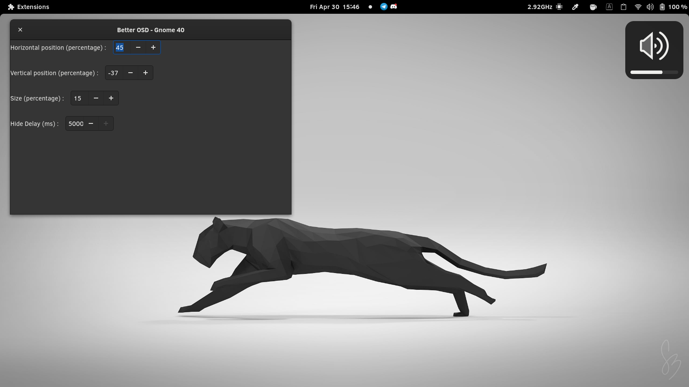
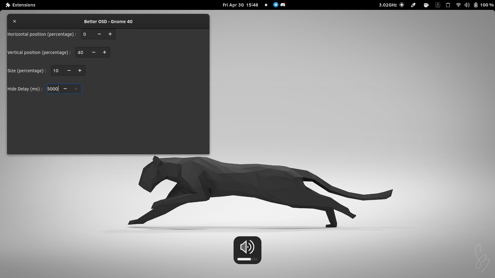

# Better OSD (GNOME 40 Extension)

A GNOME Shell extension allowing the user to set the position, size and delay of the OSD windows for sound or luminosity.

## Installation

<!-- The better option is to install it from https://extensions.gnome.org/extension/1345/better-osd/ -->

> How to manually install the extension ?

```
git clone https://github.com/hllvc/better-osd.git \
	~/.local/share/gnome-shell/extensions/better-osd
```

You may need to restart the gnome shell environnment

- logout and login again _or_
- `alt+f2` then type `r` and `enter`

## Screenshots




## Details

This is forked version modified to work with GNOME 40 from [here](https://extensions.gnome.org/extension/1345/better-osd/).

!! it does not have transparency as the original !!
