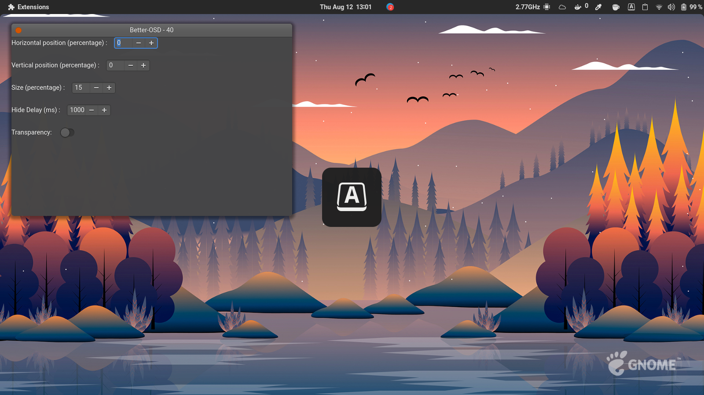
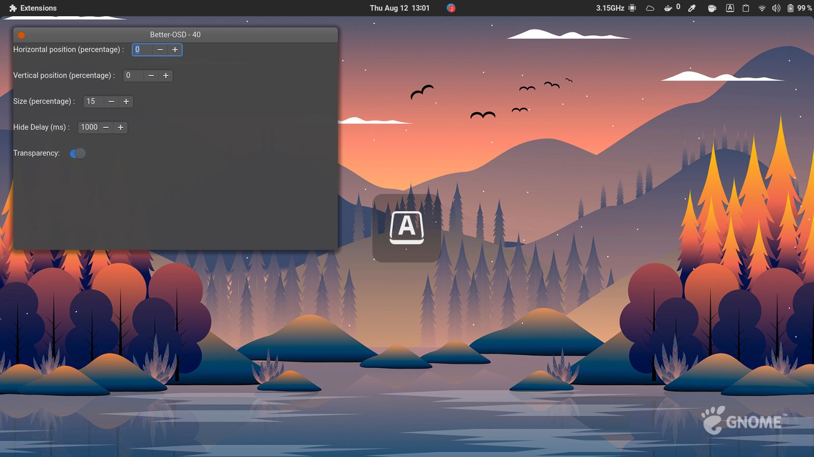

# Better OSD (GNOME 41 Extension)

A GNOME Shell extension allowing the user to set the position, size, transparency and delay of the OSD popup.

## Installation

Install from [GNOME Extensions](https://extensions.gnome.org/extension/4231/better-osd-gnome-40/).

> How to manually install the extension ?

```
git clone https://github.com/hllvc/better-osd.git \
	~/.local/share/gnome-shell/extensions/better-osd
```

You may need to restart the gnome shell environnment

- logout and login again _or_
- `alt+f2` then type `r` and `enter`

## What's new

#### 1.0
- move OSD popup with horizontal and vertical percentage
- set size percentage
- set delay of OSD popup

#### 2.0
- added transparency toggle

## Upcoming

- transparency slider for custom opacity
- refined preference window

## Screenshots


> without transparency


> with transparency


## Details

This is forked version modified to work with GNOME 40 from [here](https://extensions.gnome.org/extension/1345/better-osd/).
